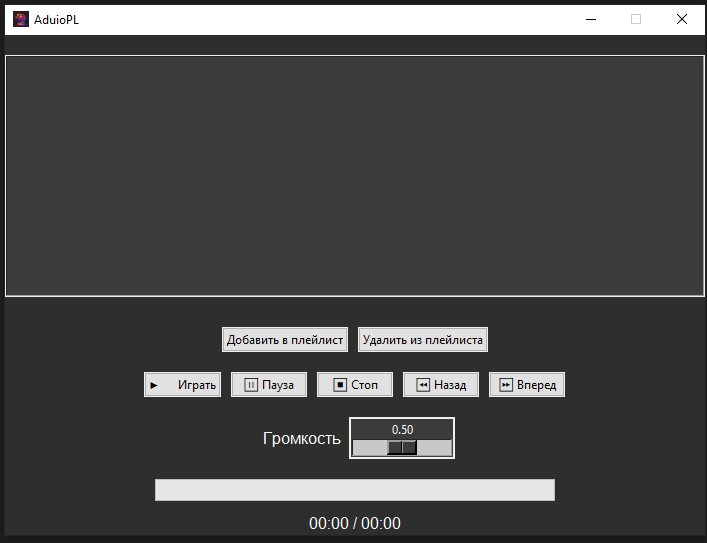

# AudioPL

## Description

**AudioPL** is an educational project aimed at exploring how Python interacts with audio. The project demonstrates basic and advanced techniques for processing, analyzing, and manipulating audio files.

## Features

- **Audio Playback**: Play, pause, and stop audio files.  
- **Educational Focus**: Learn Python's capabilities with audio processing libraries.

## License

This project is licensed under the Apache License, Version 2.0. 
